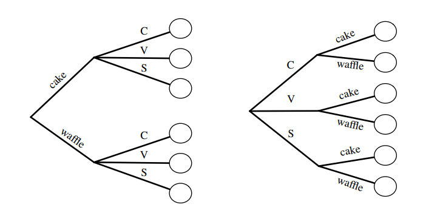
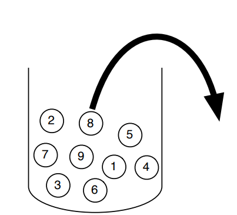

# Contar {#contar}

## Regla de la multiplicación 

Supongamos que se tiene un experimento compuesto (experimento con múltiples componentes). Si el primer componente tiene $n_1$ posibles resultados, el 2do tiene $n_2$ posibles resultados, ... , y el r-ésimo componente tiene $n_r$ posibles resultados, entonces hay $n_1*n_2*\dots*n_r$ posibilidades para el experimento.

## Espacio muestral

Contiene el número de posibles muestras de tamaño $k$ de una población de tamaño $n$, bajo varios supuestos sobre como fue recolectada la muestra.

| Reemplazo | Orden importa | Orden no importa |
|---------------|:----------------------:|:----------------------------:|
| Con reemplazo |    $n^{k}$             | $\displaystyle{n +k-1 \choose k}$ |
| Sin remplazo  |    $\frac{n!}{(n-k)!}$ | $\displaystyle{n \choose k}$ |

## Definición simple de probabilidad

Si todos los resultados son igual de posibles, la probabilidad de que un evento A ocurra es:

$P_{simple}(A)=\frac{\text{Numero de resultados favorables para A}}{\text{Numero de resultados}}$