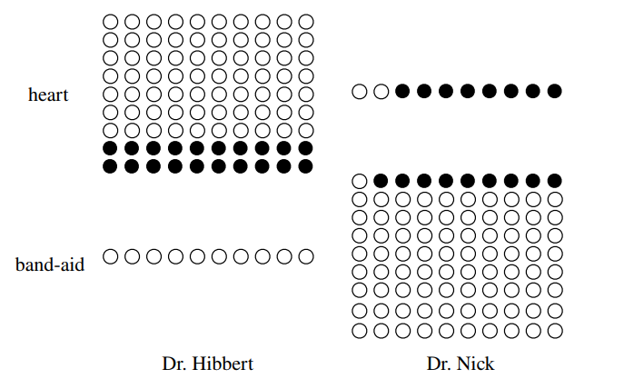
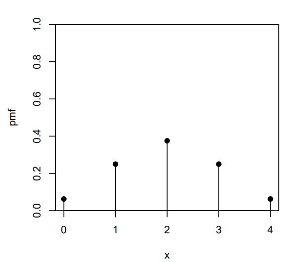
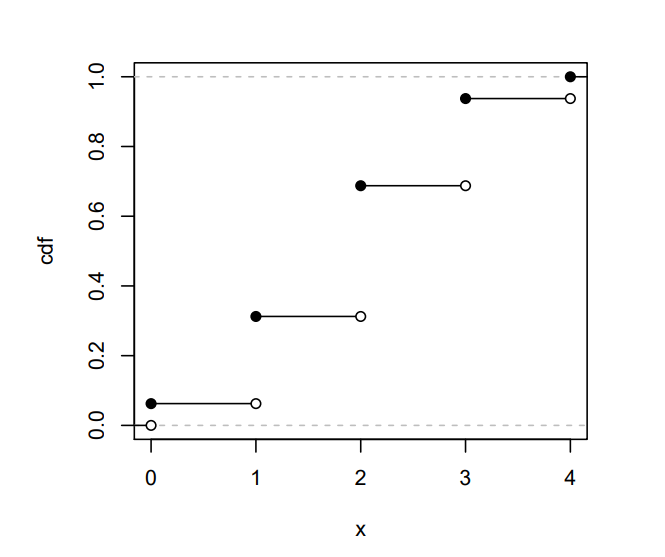
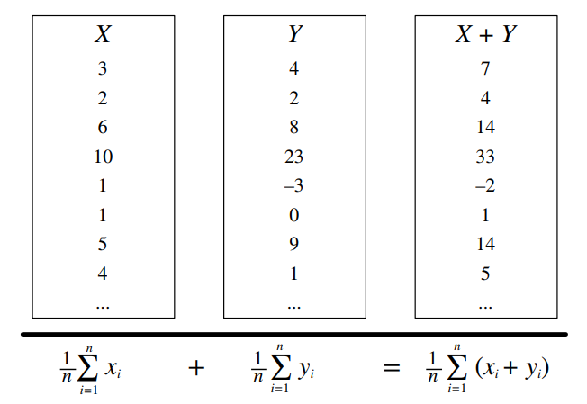

# Pensando condicionalmente {#condicional}

## Independencia 
$\textbf{Eventos Independientes:}$ A y B son independientes si conociendo que el hecho de que A ocurrió no brinda información sobre si B ocurrió. Mas formalmente, A y B (lo cual tiene probabilidad de 0) son independientes si y solo si una de las siguientes sentencias equivalentes se cumple:

$P(A\displaystyle\cap B) = P(A)P(B)$

$P(A|B)=P(A)$

$P(B|A)=P(B)$

$\textbf{Independencia condicional:}$ A y B son condicionalmente independientes dado C si $P(A\cap B|C) = P(A|C)P(B|C)$. La independencia condicional no implica independencia, y la independencia no implica independencia condicional. 

## Uniones, Intersecciones y Complementos

$\textbf{Ley de De Morgan:}$ Una identidad útil que puede hacer que el calculo de probabilidades de uniones sean mas fáciles es relacionándolas con las intersecciones y viceversa. Resultados análogos se mantienen con más de 2 grupos.

$(A \cup B)^c = A^c \cap B^c$

$(A \cap B)^c = A^c \cup B^c$

## Conjuntas, Marginales y Condicionales

$\textbf{Probabilidad Conjunta:}$ $P(A\cap B)$ y $P(A,B)$ = Probabilidad de A y B

$\textbf{Probabilidad Marginal (Incondicional):}$ $P(A)$ = Probabilidad de A

$\textbf{Probabilidad Condicional:}$ $P(A|B) = \frac{P(A,B)}{P(B)}$ = Probabilidad de A dado B 

$\textbf{La Probabilidad Condicional es una probabilidad:}$ $P(A|B)$ es una función de probabilidad para cualquier $B$ fija. Cualquier teorema que aplique para probabilidad también aplicqq para probabilidad condicional.

## Probabilidad de Unión o Intersección

$\textbf{Intersección por condicionalidad:}$ 

$P(A\cup B) = P(A) + P(B) - P(A\cap B)$

$P(A\cup B \cup C) = P(A) + P(B) + P(C) - P(A\cap B) - P(A \cap C) - P(B \cap C) + P(A\cap B \cap C)$

## La paradoja de Simpson:

Es posible tener $P(A|B,C) < P(A|B^{c},C)$ y $P(A|B,C^c) < P(A|B^c,C^c)$ pero también $P(A|B) > P(A|B^c)$

## Ley de la Probabilidad Total (LPT)
Sea $B_1,B_2,B_3,...,B_n$ una $\textit{particion}$ del espacio muestral (es decir, son disjuntas y su unión es el espacio muestral completo).

$P(A) = P(A|B_1)P(B_1) + P(A|B_2)P(B_2) + ... + P(A|B_n)P(B_n)$

$P(A) = P(A \cap B_1) + P(A\cap B_2) + .. + P(A\cap B_n)$

Para $\textbf{LPT con condicionalidad extra}$, solo se agrega otro evento $C!$

$P(A|C) = P(A|B_1,C)P(B_1|C) + .. + P(A|B_n,C)P(B_n|C)$

$P(A|C) = P(A\cap B_1|C) + P(A\cap B_2|C) + ... + P(A\cap B_n|C)$

Un caso especial de LPT con $B$ y $B^c$ como partición:

$P(A) = P(A|B)P(B) + P(A|B^c)P(B^c)$

$P(A) = P(A\cap B) + P(C\cap B^c)$

## Regla de Bayes
$\textbf{La regla de Bayes con condicionalidad extra (solo se agrega C!)}$

$P(A|B) = \frac{P(B|A)P(A)}{P(B)}$

$P(A|B,C) = \frac{P(B|A,C)P(A|C)}{P(B|C)}$

También se puede escribir

$P(A|B,C) = \frac{P(A,B,C)}{P(B,C)} = \frac{P(B,C|A)P(A)}{P(B,C)}$

$\textbf{Forma de "Odds" de la Regla de Bayes}$

$\frac{P(A|B)}{P(A^c|B)} = \frac{P(B|A)}{P(B|A^c)} \frac{P(A)}{P(A^c)}$

Los $\textit{odds posteriores}$ de A son la $\textit{razón de verosimilitud}$ por los $\textit{odds anteriores}$

# Variables aleatorias y sus distribuciones

## CFD, PDF e Independencia 
$\textbf{Función de probabilidad (PDF):}$ Da la probabilidad que una variable $\textit{discreta}$ tiene para un valor $x$

$p_X(x) = P(X=x)$

La PDF satisface que:
$p_X(x) \ge 0$ y $ \displaystyle\sum_{x} p_X(x) = 1$

$\textbf{Funcion de distribución (CDF):}$ Da la probabilidad de que una variable aleatoria sea menor o igual a $x$.
$F_x(x) = P(X\le x)$

La CDF es una función continua y continua hacia la derecha con
$F_X(x) \rightarrow 0 cuando x \rightarrow  - \infty$ y $F_X(x) \rightarrow 1$ cuando $x \rightarrow \infty$

$\textbf{Independencia:}$ Intuitivamente, dos variables aleatorias son independientes si conociendo el valor de una, no se logra conocer información de la otra. 
Dos muestras de variables aleatorias discretas X y Y son independientes si para todos los valores de x y y
$P(X=x, Y=y) = P(X=x)P(Y=y)$

# Valores esperados y Función indicadora

## Valor esperado y Linealidad

$\textbf{Valor esperado:}$ (media, expectativa o promedio) es un promedio ponderado de los posibles resultados de nuestra variable aleatoria.
Matemáticamente, si $x_1, x_2, x_3,...$ son todos los distintos valores posibles que $X$ puede tomar, entonces el valor esperado de $X$ es

$E(X) = \sum_{i} x_iP(X=x_i)$

$\textbf{Linealidad:}$ Para cualquier muestra de variables aleatorias $X$ y $Y$, y las constantes $a,b,c$,
$E(aX +bY+c) = aE(X) + bE(Y) +c$

$\textbf{Misma distribucion implica misma media:}$ Si $X$ y $Y$ tienen la misma distribución, entonces $E(X) = E(Y)$ y, de forma mas general:
$E(g(X)) = E(g(Y))$

$\textbf{Valor esperado condicional:}$ se define como un valor esperado pero condicionado a un evento  $A$ cualquiera
$E(X|A)= \sum_{x} x P(X=x|A)$

## Función Indicadora

$\textbf{Función indicadora:}$ es una variable aleatoria que toma los valores 1 o 0. Es el indicador de un evento: si el evento ocurre, el indicador es 1; de otra forma es 0. Son útiles para muchos problemas de contar cuantos eventos de un tipo ocurren. 
$I_A= \left \{ \begin{matrix} 1 & \mbox{si }A\mbox{ ocurre}\\ 0 & \mbox{si }A\mbox{ no ocurre}\end{matrix}\right.$

Note que $I^2_A= I_A, I_AI_B = I_{A \cap B}$, y $I_{A \cup B =I_A + I_B-I_AI_B}$.

$\textbf{Distribución}:I_A \sim Bern(p)$ donde $p=P(A)$ 

$\textbf{Puente fundamental}$ El valor esperado de la función indicadora de un evento A es la probabilidad del evento A: $E(I_A) = P(A)$.

### Varianza y desviación estándar

$Var(X)=E(X-E(X))^2 = E(X^2) - (E(X))^2$

$SD(X) =  \sqrt{Var(X)}$

