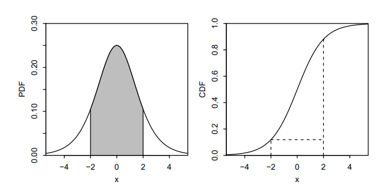

# Va Continuas, LOTUS, UoU {#va}

## Variables aleatorias continuas:

$\textbf{¿Cual es la probabilidad de que una v.a.c. este en un intervalo?}$ Utilice la diferencia entre la funciones de distribución.
$P(a\le X \le b) = P(X \le b) - P(X \le a) = F_X(b)-F_X(a)$

Para $X \sim N(\mu, \sigma^2)$, esto se convierte en

$P(a\le X \le b) = \Phi \Big(\frac{b - \mu}{\sigma} \Big) - \Phi \Big(\frac{a-\mu}{\sigma} \Big)$

$\textbf{¿Cual es la funcion de densidad? (PDF):}$ La pdf es la derivada de la función de distribución.
$F^, = f(x)$

La función de densidad es no negativa e integra a 1. Por el teorema fundamental de calculo, para obtener la función de distribución desde la función de densidad, se hace la integral:

$F(x) = \int_{-\infty}^{x} f(t) dt$

Para encontrar la probabilidad de que una v.a.c. tome un valor en un intervalo, integre la PDF sobre ese intervalo 

$F(b)-F(a)=\int_{a}^{b} f(x)dx$

$\textbf{¿Cómo encuentro el valor esperado de la funcion de distribucion?}$ Análogo al caso discreto, donde la suma de $x$ multiplicado por la función de probabilidad, para V.a.C se puede integrar $x$ multiplicada por la función de densidad

$E(X)= \int_{-\infty}^{\infty} xf(x) dx$

 
## LOTUS

$\textbf{Valor esperado de una funcion de v.a}$ El valor esperado de $X$ esta definido como:
$E(X) = \sum_x xP(X=x)$ (para X discreta)
$E(X) = \int_{-\infty}^{\infty} xf(x) dx$ (para X continua)

La $\textbf{Ley del Estadistico Inconsciente}$ dice que se puede encontrar el valor esperado de una $\textit{funcion de una v.a, g(x)}$, de forma similar, reemplazando la x en frente de la función de densidad/probabilidad con g(x) y aún funciona con la función de densidad/probabilidad.

$E(g(X)) = \sum_x g(x) P(X=x) $ (para X discreta)

$Eg((X)) = \int_{-\infty}^{\infty} g(x)f(x) dx$ (para X continua)

$\textbf{¿Cuál es la función de una variable aleatoria?}$ La función de una v.a es también una v.a. Por ejemplo, si X es el número de bicicletas que usted puede ver en una hora, entonces $g(X) = 2X$ es el número de llantas de bicicletas que usted puede ver en una hora y $h(X) = \displaystyle{X \choose 2}$ es el número de $\textit{pares}$ de bicicletas que ve en esa hora.

$\textbf{¿Cual es el objetivo?}$ No se necesita saber la función de probabilidad/densidad de g(X) para obtener su valor esperado. Solo se necesita la función de probabilidad/densidad de X.

## Universalidad de la Uniforme (UoU)

Cuando se introduce una v.a.c en su propia función de distribución, se obtiene una variable Uniforme(0,1). Cuando se introduce una v.a Uniforme(0,1) en una función de distribución inversa, se obtiene una v.a. con esa función de distribución. Por ejemplo, digamos que una variable aleatoria X tiene una función de distribución
$F(x) = 1 - e^{-x} , si x > 0$

Gracias a UoU,  si introducimos X en esta función y obtenemos un v.a. uniforme

$F(X) = 1 - e^{-x} \sim Unif(0,1)$

Similarmente, si $U \sim Unif(0,)$ entonces $F^{-1}(U)$ tiene una CDF, F. El punto clave es que a cualquier v.a.c $X$, podemos transformarla en una variable Uniforme y viceversa, usando su CDF.

