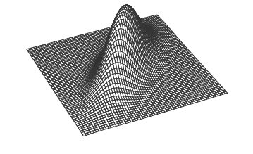

# PDFs y CDFs conjuntas {#pdf}

## Distribuciones conjuntas
La función de distribución conjunta de X y Y es 
$F(x,y)=P(X\leq x, Y \leq y)$

En el caso discreto X y Y tienen la $\textbf{PMF conjunta}$
$p_{X,Y}(x,y)= P(X=x, Y=y).$

En el caso continuo, tienen una $\textbf{PDF conjunta}$
$f_{X,Y}(x,y)=\frac{\partial^2 }{\partial x \partial y} F_{X,Y}(x,y).$

La PMF,PDF conjunta debe ser no negativa y sumar/integrar a 1.

## Distribuciones Condicionales

$\textbf{Regla condicional y de Bayes para v.a. discreta}$

$P(Y=y|X=x)= \frac{P(X=x, Y=y)}{P(X=x)}=\frac{P(X=x|Y=y)P(Y=y)}{P(X=x)}$

$\textbf{Regla condicional y de Bayes para v.a. continuas}$

$f_{Y|X}(y|x)=\frac{f_{X,Y}(x,y)}{f_X(x)}=\frac{f_{X|Y}(x|y)f_Y(y)}{f_X(x)}$

$\textbf{La regla híbrida de Bayes}$

$f_X(x|A)=\frac{P(A|X=x)f_X(x)}{P(A)}$

## Distribuciones Marginales
Para encontrar la distribución de una (o más) variables aleatorias a partir de una PMF/PDF conjunta, se debe sumar/integrar sobre la variable aleatoria que no interesa.
$\textbf{PMF marginal a partir de una PMF conjunta}$

$P(X=x)=\displaystyle\sum_{y}P(X=x, Y=y)$

$\textbf{PDF marginal a partir de una PDF conjunta}$

$f_X(x)=\displaystyle\int_{-\infty}^{\infty} f_{X,Y}(x,y)\, dy$

## Independencia de Variables Aleatorias
Las variables aleatorias X y Y son independientes si y solo si cualquiera de las siguientes condiciones se cumple:

$\bullet$ La CDF conjunta es el producto de las CDFs marginales

$\bullet$ La PMF/PDF conjunta es el producto de las PMFs/PDFs marginales

$\bullet$ La distribución condicional de Y dado X es la distribución marginal de Y

Escriba X $\perp$ Y para denotar que X y Y son independiente

## LOTUS multivariado
LOTUS en más de una dimensión es el análogo de LOTUS de una dimensión.
Para variables aleatorias discretas:

$E(g(X,Y))=\displaystyle\sum_{x}\displaystyle\sum_{y} g(x,y)P(X=x, Y=y)$

Para variables aleatorias continuas:

$E(g(X,Y))=\displaystyle\int_{-\infty}^{\infty}\displaystyle\int_{-\infty}^{\infty} g(x,y)f_{X,Y}(x,y)dxdy$

