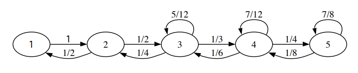
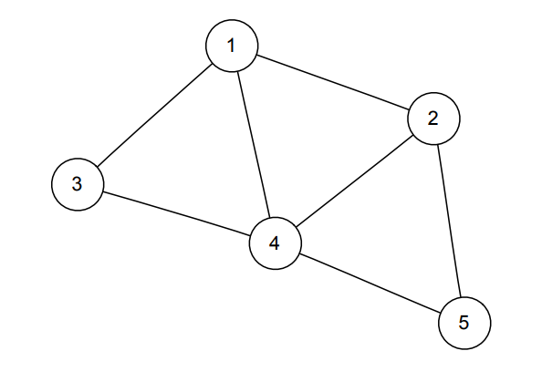

# Cadenas de Markov {#markov}

## Definición 

Una Cadena de Markov es una caminata aleatoria en un espacio de estados, el cual asumimos que es finito, digamos {$1,2,...,M$}.Decimos que $X_t$ denota cual elemento del espacio de estados de la caminata es visitado en el tiempo $t$. La Cadena de Markov es la secuencia de variables aleatorias que rastrean donde está la caminata en todos los puntos del tiempo, $X_0, X_1, X_2,...$. Por definición una Cadena de Markov tiene que cumplir con la $\textbf{propiedad de Markov}$, la cual dice que si usted quiere predecir donde la cadena va a estar en el futuro, si conocemos en estado presente entonces toda la historia pasada es irrelevante. $\textit{Dado el presente, el pasado y futuro son condicionalmente independientes}$. En símbolos,
$P(X_{n+1}=j|X_0=i_0, X_1=i_1,...,X_n=i)=P(X_{n+1}=j|X_n=i)$

## Propiedades de los estados
Un estado es recurrente o transitorio.

$\bullet$ Si empieza con un $\textbf{estado recurrente}$, entonces siempre va a volver al estado en algún punto en el futuro. 

$\bullet$ De otra forma, se está en un $\textbf{estado transitorio}$. Hay una probabilidad positiva de que una vez que se vaya de ahí, nunca vuelva.

Un estado es periódico o aperiódico

$\bullet$ Si empieza en un $\textbf{estado periódico}$ de periodo k, entonces el MCD de los posibles números de pasos que se necesitarían para volver es $k>1$.

$\bullet$ De otra forma, se encuentra en un $\textbf{estado aperiódico}$. El MCD de los posibles números de pasos que se necesitarían para volver es 1.

## Matriz de transición 
Sea {$1,2,..,M$} el espacio de estados. La matriz de transición $Q$ es la matriz $M \times M$ donde el elemento $q_{ij}$ es la probabilidad de que la cadena cambie del estado $i$ al estado $j$ en un paso:

$q_{ij}=P(X_{n+1}=j|X_n=i)$

Para encontrar la probabilidad de que la cadena cambie del estado $i$ al estado $j$ en exactamente $m$ pasos, tome el $(i,j)$ elemento de $Q^m$.

$q_{ij}^{(m)}=P(X_{n+m}=j|X_n =i)$

Si $X_0$ está distribuida de acuerdo a vector fila PMF $\vec{p}$, e.j., $p_j=P(X_0=j)$, entonces el PMF de $X_n$ es $\vec{p}Q^n$.

## Propiedades de la cadena
Una cadena es $\textbf{irreducible}$ si se puede ir de un lugar a cualquier otro. Si una cadena (en un espacio de estados infinito) es irreducible, entonces todos sus estados son recurrentes. Una cadena es $\textbf{periódica}$ si cualquiera de sus estado es periódica, y es aperiódica si ninguno de sus estados es periódico. En una cadena irreducible, todos los estado tienen el mismo periodo.

Una cadena es $\textbf{reversible}$ con respecto a $\vec{s}$ si $s_iq_{ij}=s_jq_{ji}$ para todo $i,j$.
Ejemplos de cadenas reversibles incluyen cualquier cadena con $q_{ij}=q_{ji}$, con $\vec{s}=(\frac{1}{M}, \frac{1}{M},...,\frac{1}{M})$, y una caminata aleatoria en una red no dirigida.

## Distribución Estacionaria

Digamos que el vector $\vec{s}=(s_1, s_2,...,s_M)$ es una PMF (escrito como un vector fila). Le diremos $\textbf{distribución estacionaria}$ de la cadena a $\vec{s}$  si $\vec{s}Q=\vec{s}$. Como consecuencia, si $X_t$ tiene la distribución  estacionaria, entonces todas las futuras $X_{t+1}, X_{t+2},...$ tienen la distribución estacionaria.
Para cadenas irreducibles y aperiódicas, la distribución estacionaria existe, es única y $s_i$ es la probabilidad a largo plazo de que una cadena este en el estado $i$. El número esperado de pasos para volver a $i$ empezando en $i$ es $1/s_i$.
Para encontrar la distribución estacionaria, también puede resolver la ecuación matricial $(Q' - I)\vec{s}' =0$. La distribución estacionaria es uniforme si las columnas de $Q$ suman 1.

$\textbf{La condición de reversibilidad implica estacionariedad}$

Si usted tiene una PMF $\vec{s}$ y una cadena de Markov con una matriz de transición $Q$, entonces $s_i q_{ij}=s_jq_{ji}$ para todos los estados $i,j$ implica que $\vec{s}$ es estacionario.

## Caminata Aleatoria en una Red Indirecta

Si usted tiene una colección de $\textbf{nodos}$, de los cuales los pares se pueden conectar con $vérticess$ indirectos, y una cadena de Markov consiste en ir de un nodo actual a un nodo uniformemente aleatorio conectado a este con un vértice, eso es una caminata aleatorio en una red indirecta. La distribución estacionaria de una cadena es proporcional a la secuencia de grado (es la secuencia de grados, donde el grado de un nodo es cuantos vértices están unidos a este). Por ejemplo, la distribución estacionaria de una caminata aleatoria en una red mostrada arriba es proporcional a $(3,3,2,4,2)$, y también $(\frac{3}{14},\frac{3}{14},\frac{3}{14},\frac{4}{14}, \frac{2}{14})$.

