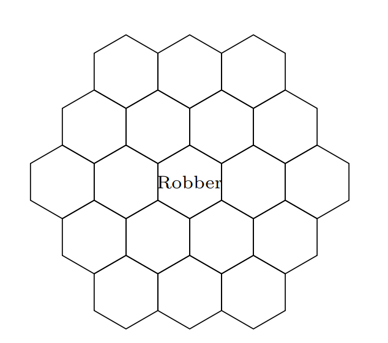

# Ejemplos {#ejemplos}

Contribuciones de Sebastian Chiu

## Calculando Probabilidades

Un libro tiene $n$ errores de escritura, los cuales están dispersos en las $n$ páginas independientemente. Usted escoge una página aleatoria. ¿Cuál es la probabilidad de que no tenga errores.

$\textbf{Respuesta:}$ Hay una probabilidad de $(1-\frac{1}{n})$ de que cualquier errores específico no este en la página, y entonces hay una probabilidad $\Big(1-\frac{1}{n} \Big)^n$ de que no haya ningún error en nuestra página. Para n grande, esto es aproximadamente $e^{-1} = 1/e$.

## Linealidad e Indicadores (1)

$\textit{Este problema es comúnmente conocido como el}$ $\textbf{problema de emparejamiento}$.
Hay $n$ personas en una fiesta, cada uno con un sombrero. Al final de la fiesta, se tienen que ir con un sombrero al azar. ¿Cuál es el número esperado de personas que se vayan con el sombrero correcto? 

$\textbf{Respuesta:}$ Cada sombrero tiene una probabilidad de $1/n$ de irse con la persona correcta. Por linealidad, el promedio de sombreros que se van con sus dueños es $n(1/n)=1$.

## Linealidad y Primeros Éxitos

$textbf{Este problema es comúnmente conocido como el}$ $\textbf{problema del coleccionista de cupones.}$
Hay $n$ tipos de cupones. En cada sorteo, usted obtiene un tipo de cupón uniformemente distribuido. ¿Cuál es número de cupones necesarios hasta que se complete el juego? 
 
$\textbf{Respuesta:}$ Sea N el numero de cupones necesarios; queremos $E(N)$. Sea $N=N_1+...+N_n$, donde $N_1$ es el sorteo donde se obtiene nuestro primer cupón, $N_2$ es el sorteo $\textit{adicional}$ para obtener nuestro segundo cupón y si sucesivamente. Recordando la historia del Primer Éxito, $N_2 \sim FS((n-)/n)$ (después de recolectar el primer tipo de cupón, hay una probabilidad de $(n-1)/n$ de que usted va a obtener algo nuevo). Similarmente, $N_3 \sim FS((n-2)/n)$ y $N_j \sim FS((n-j+1)/n)$. Por linealidad,
$E(N)=E(N_1)+...+E(N_n)=\frac{n}{n}+\frac{n}{n-1}+...+\frac{n}{1}= n \displaystyle\sum_{j=1}^{n} \frac{1}{j}$
Esto es aproximadamente $n(log(n)+0.577)$ por la aproximación de Euler.

## Ordenamientos de variables aleatorias i.i.d.

Yo llamo 2 UberXs y 3 Lyfts al mismo tiempo. Si los tiempos que duran los carros en llegar a mi son i.i.d., ¿cuál es la probabilidad de que los 3 Lyfts lleguen al mismo tiempo? 

$\textbf{Respuesta:}$ Dado que los tiempos de llegada de los cinco carros son i.i.d., los $5!$ ordenamientos de las llegadas son igualmente posibles. Hay $3!2!$ ordenamientos que involucran que los Lyfts lleguen primero, entonces la probabilidad de que los Lyfts lleguen primero es $\frac{3!2!}{5!}=1/10$. Alternativamente, hay $ 5\choose 3$ maneras de escoger 3 de los 5 campos para que los Lyfts los ocupen, donde cada una de las opciones es igualmente posibles. En una de esas opciones tiene los 3 Lyfts llegan primero entonces la probabilidad es $1/{5 \choose 3} =1/10$.

## Expectativa de una Hipergeométrica Negativa

¿Cuál es el número esperado de cartas que usted va a sacar antes de sacar su primer As en un mazo (sin contar el As)?

$\textbf{Respuesta:}$ Considere un carta que no es As. Denote esta como una carta $j$. Sea $I_j=1$ el indicador de que la carta $j$ va a ser elegida primero que el primer As. Note que $I_j =1$ dice que $j$ es antes que los 4 Ases del mazo. La probabilidad de que esto ocurra es $1/5$ por simetría. Sea X el número de cartas que salen entes del primer As. Entonces $X=I_1+I_2+...+I_{48}$, donde cada indicador corresponde a uno de los 48 "no Ases". Entonces,
$E(X)=E(I_1)+E(I_2)+...+E(I_{48})=48/5 = 9.6$

## Mínimo y Máximo de VAs

¿Cuál es la CDF del máximo de $n$ v.a. $Unif(0,1)$ independientes?

$\textbf{Respuesta:}$ Note que para las v.a $X_1, X_2,...,X_n$,
$P(min(X_1,X_2,...,X_n)\ge a)=P(X_1 \ge a, X_2 \ge a,..., X_n \ge a)$

Similarmente

$P(min(X_1,X_2,...,X_n)\le a)=P(X_1 \le a, X_2 \le a,..., X_n \le a)$

Usaremos este principio para encontrar la CDF de $U_{(n)}$, donde
$U_{(n)}=max(U_1, U_2,...,U_n)$ y las $U_i \sim Unif(0,1)$ son i.i.d.
$P(max(U_1,U_2,...,U_n)\le a)=P(U_1 \le a, U_2\le a,..., U_n \le a)$
                            $=P(U_1 \le a)P(U_2 \le a)...P(U_n \le a)$
                            $=a^n$
Para $0<a<1$ (y la CDF es 0 para $a\le 0$ y  para $a \ge 1$).

## Emparejando patrones con la serie de Taylor 

Para $X \sim Pois(\lambda)$, encuentre $E\Big(\frac{1}{X+1} \Big)$.

$\textbf{Respuesta:}$
Por LOTUS, $E\Big(\frac{1}{X+1} \Big)= \displaystyle\sum_{k=0}^{\infty} \frac{1}{k+1} \frac{e^{-\lambda} \lambda^k}{k!}=\frac{e^{-\lambda}}{\lambda} \displaystyle\sum_{k=0}^{\infty} \frac{\lambda^{k+1}}{(k+1)!}=\frac{e^{-\lambda}}{\lambda}(e^{\lambda} -1)$

## La Ley de Adán y Eva

A William le gusta mucho resolver rápidamente Cubos Rubik. Pero es muy malo haciéndolo, entonces a veces falla. En un día cualquiera, William va a intentar $N \sim Geom(s)$ Cubos Rubik. Suponga que cada vez, William tiene la probabilidad $p$ de resolver el cubo (independiente). Sea $T$ el número de cubos Rubik que resuelve durante el día. Encuentre la media y la varianza de $T$.

$\textbf{Respuesta:}$ Note que $T|N \sim Bin(N,p)$. Entonces por la Ley de Adán,
$E(T)=E(E(T|N))=E(Np)=\frac{p(1-s)}{s}$

Similarmente, por la Ley de Eva, tenemos que
$Var(T)=E(Var(T|N))+Var(E(E|N))=E(Np(1-p))+Var(Np)$
      $=\frac{p(1-p)(1-s)}{s}+\frac{p^2(1-s)}{s^2}=\frac{p(1-s)(p+s(1-p))}{s^2}$
      
## FGM - Encontrando Momentos

Encuentre $E(X^3)$ para $Expo(\lambda)$ usando la FGM de X. 

$\textbf{Respuesta:}$ La FGM de una $Expo(\lambda)$ es $M(t)=\frac{\lambda}{\lambda-t}$. Para obtener el tercer momento, podemos tomar la tercer derivada de la FGM y evaluar en $t=0$:
$E(X^3)=\frac{6}{\lambda^3}$
Pero una mejor forma de usar la FGM es para reconocer patrones:
note que $M(t)$ luce como si viniera de una serie geométrica:
$\frac{1}{1-\frac{t}{\lambda}}=\displaystyle\sum_{n=0}^{\infty} \Big(\frac{t}{\lambda} \Big)^n = \displaystyle\sum_{n=0}^{\infty}\frac{n!}{\lambda ^n}\frac{t^n}{n!}$
El coeficiente de $\frac{t^n}{n!}$ aquí es el $n-esimo$ momento de X, entonces tenemos $E(X^n)=\frac{n!}{\lambda^n}$ para todos los enteros no negativos $n$.

## Cadenas de Markov (1)

Suponga que $X_n$ es una cadena de Markov de dos estados con la matriz de transición
                                                           $0$                     $1$
$Q=\begin{matrix} 0  \\ 1 \end{matrix} \begin{pmatrix} 1-\alpha & \alpha \\ \beta & 1-\beta \end{pmatrix} $
Encuentre la distribución estacionaria $\vec{s}=(s_0,s_1)$ de $X_n$ resolviendo $\vec{s}Q=\vec{s}$, y muestre que la cadena es reversible con respecto a $\vec{s}$.

$\textbf{Respuesta:}$ La ecuación $\vec{s}Q=\vec{s}$ dice que
$s_0 = s_0(1-\alpha)+s_1\beta$ y $s_1=s_0(\alpha)+s_0(1-\beta)$

Resolviendo el sistema de ecuaciones obtenemos
$\vec{s}=\Big(\frac{\beta}{\alpha + \beta}, \frac{\alpha}{\alpha + \beta}$

Para mostrar que la cadena es reversible con respecto a $\vec{s}$, debemos mostrar $s_iq_{ij}=s_j q_{ji}$ para todo $i,j$. Esto se hace mostrando que $s_0 q_{01}=s_1q_{10}$. Y de hecho,
$s_0q_{01}=\frac{\alpha \beta }{\alpha + \beta}=s_1q_{10}$

## Cadenas de Markov (2)

William y Sebastian están jugando un juego modificado de Catan, donde en cada turno mueven aleatoriamente un ladrón (el cual empieza en el cuadro del centro) a uno de los hexágonos adyacentes.

(a) ¿Esta cadena de Markov es irreducible? ¿Es aperiódica?

$\textbf{Respuesta:}$ Si ambas. La cadena es irreducible porque puede ir de un lugar a cualquier otro. La cadena también es aperiódica porque el ladrón puede devolverse la casilla en 2,3,4,5,... pasos, y la GCD de esos numero es 1.

(b) ¿Cuál es la distribución estacionaria de esta cadena de Markov? 

$\textbf{Respuesta:}$ Como esto es una caminata aleatoria en un gráfico sin dirección, la distribución estacionaria es proporcional a la secuencia de grado. El grado para las piezas de la esquina es 3, el grado para las piezas de la orilla es 4 y el grado para las piezas del centro es 6. Para normalizar esta secuencia, la dividimos por la suma. La suma de los grados es $6(3) + 6(4) + 7(6) = 84$. Entonces la probabilidad estacionaria de estar en una esquina es 3/84=1/28%, en la orilla $4/84=/21$ y en el centro $6/84=1/14$.

(c) ¿Cuál es la fracción de tiempo que va a estar el ladrón  en la pieza del medio en este juego, en el largo plazo?

$\textbf{Respuesta:}$ Por lo anterior: 1/14.

(d) ¿Cuál es el número esperado de pasos que se necesitarán para que el ladrón regrese a la pieza del centro? 
 
$\textbf{Respuesta:}$ Como esta cadena es irreducible y aperiódica, para obtener el tiempo esperado solo tenemos que invertir la probabilidad estacionaria. Entonces, en promedio, se necesitaran 4 turnos para que el ladrón regrese  a la pieza del centro.

